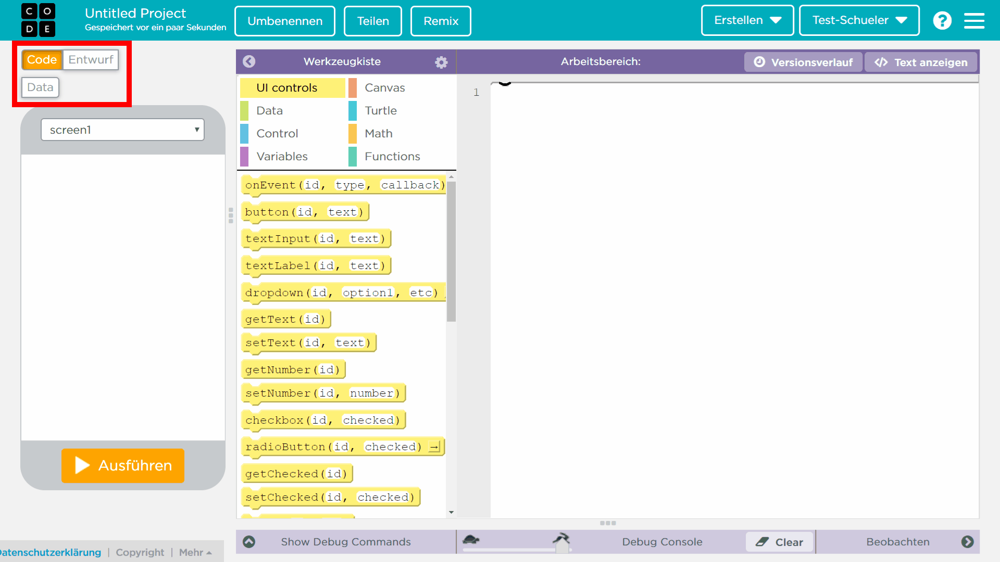
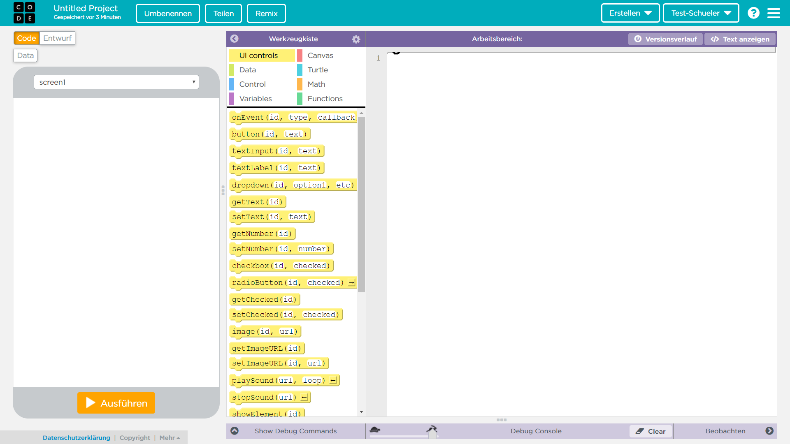

# Muskeln und Gelenke
Hallo, liebe Fünftklässler/-innen!
Hier findet ihr ein paar Aufgaben für NWT.

## Wer schreibt hier eigentlich?
Ich bin Torsten Otto, und vertrete gerade NWT bei Euch:

## Der Spaziergang
t> Sieh dir den Film an.

t> Untersuche deinen Lieblingsarm. Was kannst du alles über ihn herausfinden? Notiere deine Entdeckungen auf einem Blatt Papier.

## Aufbau des Arms.
i> Wenn du damit fertig bist, geht es weiter:

Dass man sich selbst umarmen kann, liegt natürlich daran, dass wir Gelenke haben, die dafür sorgen, dass die Arme nicht steif sind, und Muskeln, die für die Bewegung sorgen.

t> sieh dir das nächste Video an:

Die beiden Gelenke sind sehr verschieden. Auf dem Arbeitsblatt, das du vor den Ferien bekommen hast, werden z. B. Scharniergelenke und Kugelgelenke unterschieden.

i> Du kannst oben-links zwischen den Ansichten wechseln.

Hier siehst du die Benutzeroberfläche des Abb Labors.

Die Benutzeroberfläche des App Labors hat drei Ansichten:
1. die [Code-Ansicht](#Die-Code-Ansicht)
2. die [Entwurf-Ansicht](#Die-Entwurf-Ansicht)
3. die [Daten-Ansicht](#Die-Daten-Ansicht).

i> Du kannst oben-links zwischen den Ansichten wechseln.

### Die Code-Ansicht

In der Code-Ansicht gibt es drei Bereiche.
1. Auf der linken Seite siehst du deine App und kannst sie testen.
2. Auf der rechten Seite befindet sich der Arbeitsbereich. Hier wird das Programm geschrieben.
3. In der Mitte ist die Werkzeugkiste. Hier findest du verschiedene Code-Bausteine, die du per **drag-and-drop** deinem Programm hinzufügen kannst.

### Die Entwurf-Ansicht

In der Entwurf-Anischt gibt es drei Bereiche.
1. Auf der linken Seite siehst du deine App.
2. In der Mitte befindet sich die Design Toolbox.
3. Auf der rechten Seite können im Workspace die Eigenschafen (Properties) der Elemente bearbeitet werden.

### Die Daten-Ansicht
Diese Ansicht benötigst du zunächst nicht.

